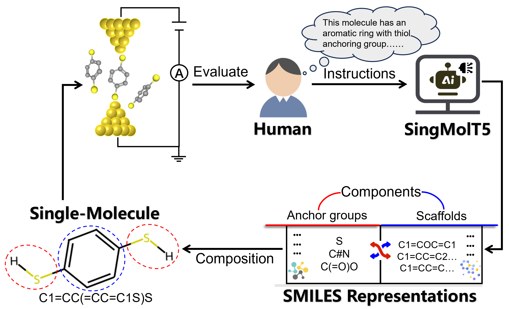
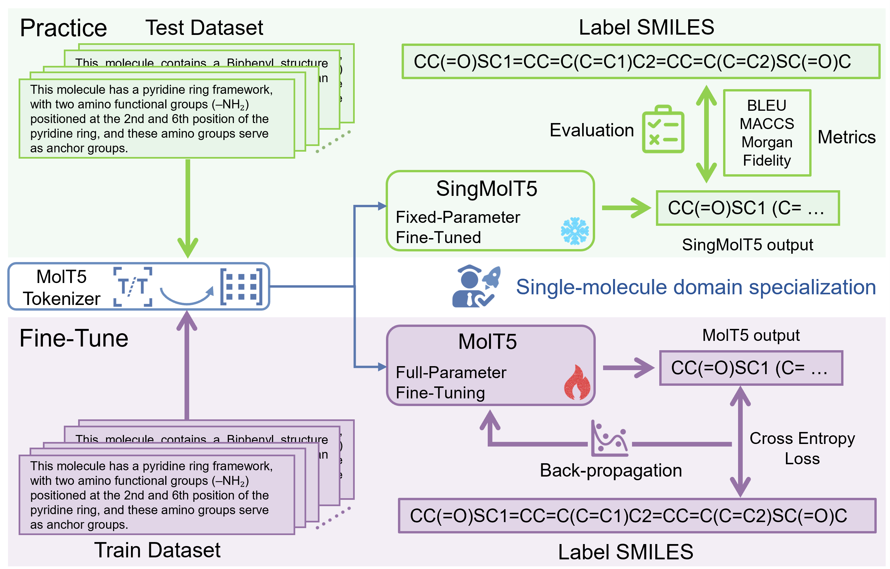

# SingMolT5
This repository hosts the official code and curated datasets for **SingMolT5**—a specialized extension of MolT5/T5 models tailored for Single-molecule generation tasks, with a primary focus on the *caption-to-molecule (cap2mol)* task (generating molecular structures from textual descriptions).

## Table of Contents
- [Introduction](#introduction)
- [Dependencies](#dependencies)
- [Dataset](#dataset)
- [Experiments](#experiments)
- [Directory Structure](#directory-structure)
- [Usage](#usage)
- [License](#license)
- [Acknowledgements](#acknowledgements)
- [Author](#author)

## Introduction
The design of single-molecule junctions is the cornerstone of molecular electronics but has long relied on chemical intuition and serendipitous discovery, lacking a systematic, intelligent design framework. Unlike traditional deep learning models that are often constrained to specific tasks, Large Language Models (LLMs) map the vast, discrete chemical space into a continuous semantic representation. This capability facilitates a paradigm shift in scientific discovery, democratizing molecular design by enabling researchers to generate complex structures through intuitive natural language descriptions. However, directly applying this generative paradigm is fundamentally hindered because general LLMs lack the intrinsic capability to adhere to the strict topological rules of single-molecule junctions, particularly regarding precise anchoring group placement and backbone configuration. Here, we present a proof-of-concept study by constructing a pilot instruction-tuning dataset and systematically evaluating two adaptation strategies—In-Context Learning (ICL) and Fine-Tuning—on pre-trained molecular LLMs. Our results reveal that while ICL demonstrates basic chemical understanding, only the fine-tuning strategy successfully captures the strict Anchor-Backbone-Anchor motifs required for molecular junction fabrication, achieving high accuracy in structural customization and generalization to homologous series. This study demonstrates the feasibility of a natural language-driven design workflow in single-molecule electronics, offering a new perspective on accelerating the discovery of functional molecular components.

Table of content：


## Dependencies
Ensure the following core dependencies are installed:
```bash
# Core Python environment
python >= 3.8
# ML/DL frameworks
pytorch >= 1.10.0
transformers >= 4.20.0  # Hugging Face Transformers (for MolT5/T5/SingMolT5)
# Data processing
pandas >= 1.4.0
openpyxl >= 3.0.0       # For XLSX dataset handling
# Jupyter (for notebook execution)
jupyter >= 1.0.0
jupyterlab >= 3.0.0

```

### Environment rebuild (Conda Recommended)
For a reproducible environment (aligned with PyTorch 2.1.1 + CUDA 12.1), use the provided Conda YAML configuration:
```bash
# Create environment from YAML file
conda env create -f Environment_rebuild.yml
# Activate the environment
conda activate environment
# Install the extra packages by pip
python -m pip install -r environment_pip.txt
```

## Dataset
The `Dataset/` directory provides structured datasets for the molecular generation (MolGen) task, available in both CSV and XLSX formats for compatibility with diverse data processing tools (e.g., Pandas, Excel, R).

| File Name               | Format | Purpose                                  |
|-------------------------|--------|------------------------------------------|
| `MolGen_Train.csv/xlsx` | CSV/XLSX | Training data for cap2mol finetuning     |
| `MolGen_Test.csv/xlsx`  | CSV/XLSX | Test data for model inference            |
| `MolGen_Evl.csv/xlsx`   | CSV/XLSX | Evaluation data for performance metrics |

All datasets are curated to align with the cap2mol task and support direct integration with SingMolT5/MolT5/T5 models.

## Experiments
All experiments are implemented as **interactive Jupyter Notebooks** in the `Finetune/` and `ICL/`directory.

### Finetuning Experiment
#### Experiment Workflow
The entire experimental pipeline for SingMolT5 is shown below:

#### 1. Finetuning (cap2mol Task)
Finetune SingMolT5/MolT5/T5 on the cap2mol task with scale-specific notebooks:
- `FTsmall_cap2mol.ipynb`: Finetuning for small-scale models
- `FTbase_cap2mol.ipynb`: Finetuning for base-scale models
- `FTlarge_cap2mol.ipynb`: Finetuning for large-scale models (note: filename typo `FTlarge_cap2mo.ipynb` is corrected here)

#### 2. Evaluation
Evaluate model performance on molecular generation metrics (e.g., validity, uniqueness, anchor fidelity) with scale-specific notebooks:
- `Eval_metrics_small.ipynb`: Evaluation for small-scale models
- `Eval_metrics_base.ipynb`: Evaluation for base-scale models
- `Eval_metrics_large.ipynb`: Evaluation for large-scale models

#### 3. Anchor Fidelity Validation
Validate the reliability of generated molecules by checking anchor fidelity across models:
- `Anchor_fidelity_T5.ipynb`: Base T5 model validation
- `Anchor_fidelity_MolT5.ipynb`: MolT5 model validation
- `Anchor_fidelity_SingMolT5.ipynb`: SingMolT5 model validation

## Directory Structure
```
SingMolT5/
├── LICENSE               # Open-source license (to be specified)
├── README.md             # Repository documentation
├── Environment_rebuild.yml     # Environment rebuild
├── environment_pip.txt         # Extra packages
├── Finetune/             # Core experimental code (Jupyter Notebooks)
│   ├── result/           # Stores experimental results (e.g., metrics, logs)
│   ├── util/             # Auxiliary utility functions for experiments
│   ├── Anchor_fidelity_*.ipynb  # Anchor fidelity validation notebooks
│   ├── Eval_metrics_*.ipynb     # Model evaluation notebooks
│   └── FT*_cap2mol.ipynb        # Finetuning notebooks for cap2mol task
└── Dataset/              # MolGen task datasets
    ├── MolGen_Train.csv/xlsx
    ├── MolGen_Test.csv/xlsx
    └── MolGen_Evl.csv/xlsx
```

## Usage
### 1. Clone the Repository
```bash
git clone https://github.com/[your-username]/SingMolT5.git
cd SingMolT5
```

### 2. Launch Jupyter Notebook
```bash
jupyter notebook
```

### 3. Run Experiments
- Open notebooks in the `Finetune/` directory (e.g., `FTbase_cap2mol.ipynb` for base-model finetuning).
- Follow the in-notebook instructions to load the dataset (from `Dataset/`), finetune the model, and run evaluation.
- Experimental results will be saved to `Finetune/result/`.

## License
This repository is licensed under the [MIT License](LICENSE) — see the `LICENSE` file for details. (Replace with your actual license, e.g., Apache 2.0, if needed)

## Acknowledgements
- This work builds on the open-source MolT5/T5 models from Hugging Face and the RDKit toolkit for molecular processing.
- We thank the contributors of molecular generation datasets for enabling reproducible research in this field.

## Author
- Yiheng Zhao (Email: a690209967@163.com)
- Saisai Yuan (Email: yuansaisai@just.edu.cn)
- Zhichao Pan (Email: panzhichao@guet.edu.cn)